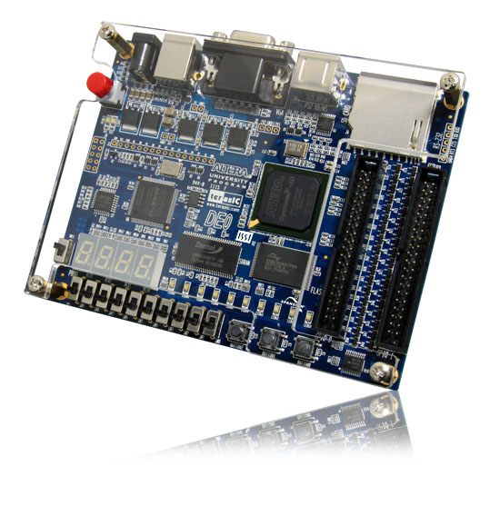

# **Começando pela DE0**

A **DE0** é uma excelente escolha para começar os estudos em design digital e FPGA. A placa DE0, baseada nos dispositivos FPGA da Altera (agora Intel), oferece uma combinação de simplicidade, recursos práticos e custo-benefício, tornando-a ideal para iniciantes e também para projetos acadêmicos ou pequenos projetos profissionais.

## **Explorando as característica da placa DE0**

### **Por que a DE0 é uma boa escolha?**

#### **1. Custo-benefício**

- A DE0 é uma das placas FPGA mais acessíveis, ideal para quem está começando sem a necessidade de um hardware de ponta.
- Possui recursos suficientes para projetos educacionais e prototipagem inicial.

---

#### **2. FPGA Cyclone III**

- **Modelo do FPGA**: Cyclone III 3C16 FPGA
  - **Elementos Lógicos (LEs)**: 15.408
  - **Memória Embutida**: 56 blocos M9K (504 Kbits de RAM total)
  - **Multiplicadores Embutidos**: 56
  - **Loops de Travamento de Fase (PLLs)**: 4
  - **Pinos de I/O do Usuário**: 346
  - **Encapsulamento**: FineLine BGA, 484 pinos

- **Memórias**
  - **SDRAM**: Chip de memória SDR (Single Data Rate) Synchronous Dynamic RAM de 8 MB.
  - **Memória Flash**: Memória NOR Flash de 4 MB. Suporte aos modos Byte (8 bits) e Word (16 bits).
  - **Slot para Cartão SD**: Suporta modos SPI e SD de 1 bit para acesso ao cartão SD.

---

#### **3. Recursos Periféricos**

A DE0 vem equipada com periféricos que permitem a interação com o mundo externo sem necessidade de acessórios adicionais:

- **LEDs**: Para saída visual de sinais. 10 LEDs verdes para saídas de uso geral.
- **Chaves DIP e botões**: Para entrada manual de sinais.
- **Conectores GPIO**: Para conectar sensores, dispositivos externos ou realizar comunicação com outras placas. Exposição de 72 pinos I/O de 3,3V do Cyclone III e 8 linhas de alimentação/terra. Compatível com cabos flat padrão de 40 pinos usados em discos rígidos IDE.
- **Displays de Sete Segmentos**: 4 displays de sete segmentos para saída numérica ou simbólica.
- **Saída VGA e áudio**: Oferece a possibilidade de criar projetos com interface gráfica e som. DAC de rede resistiva de 4 bits para geração de sinais de vídeo. Conector D-sub de 15 pinos. Suporte a resoluções de até 1280x1024 com taxa de atualização de 60 Hz.
- **Portas de Comunicação**: Porta Serial RS-232, uma porta disponível (conector DB-9 não incluído).Porta PS/2, porta única que pode ser usada com um cabo Y para conectar teclado e mouse.
- **Oscilador**: Clock onboard de 50 MHz.
- **Circuito USB Blaster Embutido**: Programação onboard via um CPLD Altera EPM240.
- **Dispositivo de Configuração**: Chip EEPROM Serial Altera EPCS4 para armazenamento de dados de configuração do FPGA.
- **Botões de Pressão (Pushbuttons)**: 3 botões para entrada do usuário.
- **Chaves Deslizantes (Slide Switches)**: 10 chaves deslizantes para entradas adicionais.

---

#### **4. Software de Suporte**

- A DE0 é compatível com o **Intel Quartus Prime**, uma ferramenta robusta e amplamente utilizada no mercado.
  - Gratuito na versão **Lite Edition**.
  - Inclui ferramentas de simulação, síntese e programação, permitindo todo o ciclo de desenvolvimento no mesmo ambiente.

---

#### **5. Material de Suporte**

- **Documentação**: A DE0 possui manuais e tutoriais detalhados, disponíveis no site da Terasic (fabricante).
- **Exemplos Práticos**: A comunidade possui diversos exemplos prontos para implementar, facilitando o aprendizado.
- **Compatibilidade com Projetos Open Source**: Há muitos projetos compartilhados que usam a DE0 como plataforma.

---

### **Possíveis Limitações**

Embora a DE0 seja uma ótima escolha para iniciantes, há algumas limitações a considerar:

1. **Tamanho do FPGA**:
   - Projetos muito complexos, como processadores customizados de alto desempenho ou redes neurais em larga escala, podem ultrapassar a capacidade da DE0.
2. **Interfaces Modernas**:
   - A DE0 não possui conectores modernos, como HDMI ou USB de alta velocidade, que podem ser encontrados em placas mais avançadas como a DE10-Nano.

---

### **Alternativas**

Se, no futuro, você precisar de mais desempenho ou recursos adicionais, pode considerar:

- **DE0-Nano**: Mais compacta, com um FPGA Cyclone IV.
- **DE10-Lite**: Uma versão atualizada com recursos semelhantes à DE0.
- **DE10-Nano**: Inclui um processador ARM, ideal para projetos que combinam FPGA e software.

---

### **Conclusão**

A DE0 é uma excelente escolha para:

- **Aprender conceitos fundamentais de FPGA**, como design digital, HDL (Verilog/VHDL), e simulação.
- **Prototipagem inicial** em projetos educacionais ou hobby.
- **Explorar recursos periféricos** e interações com o hardware.
